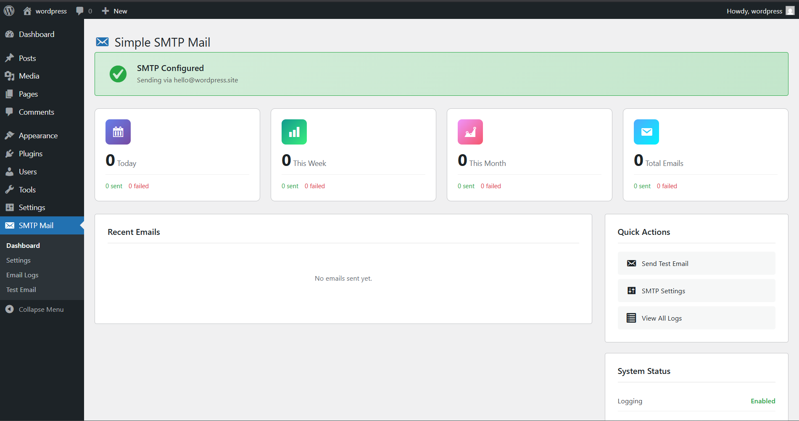
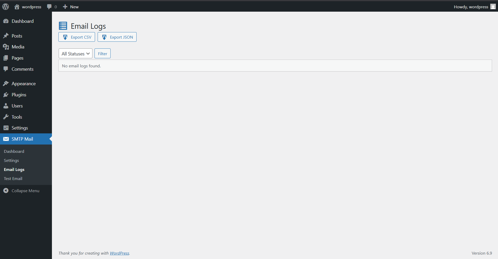
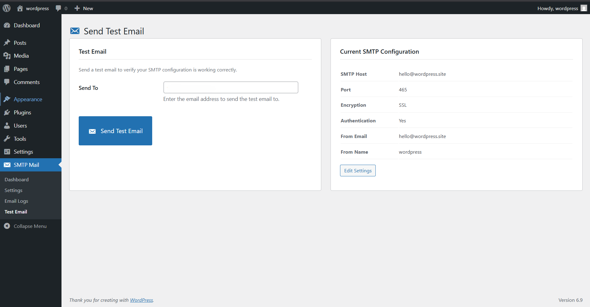

# Simple SMTP Mail

[](https://wordpress.org/)
[](https://php.net/)
[](https://www.gnu.org/licenses/gpl-2.0.html)
[](https://paypal.me/boopathirbk)

A powerful, open-source WordPress SMTP plugin with comprehensive email logging, queue management, backup SMTP failover, and a modern admin dashboard.


## ✨ Features

### 📧 SMTP Configuration
- **15+ Pre-configured Providers** - Gmail, Outlook, Office 365, Yahoo, Zoho, SendGrid, Mailgun, Amazon SES, Brevo (Sendinblue), Postmark, SparkPost, SMTP.com, Elastic Email, Mailjet, Pepipost
- **Custom SMTP Support** - Use any SMTP server with manual configuration
- **Encryption Options** - TLS (port 587), SSL (port 465), or None (port 25)
- **Secure Authentication** - Username/password with AES-256-CBC encrypted storage
- **Force From Email/Name** - Override WordPress default sender settings
- **Provider Auto-Detection** - Automatically identifies provider from SMTP host

### 📊 Email Logging
- **Complete Email History** - Track all sent, failed, and queued emails
- **Detailed Log View** - View full email content, headers, CC/BCC, and attachments
- **Searchable Logs** - Find emails by recipient, subject, or status
- **Date Range Filtering** - Filter logs by specific date ranges
- **Export Options** - Download logs as CSV or JSON format
- **Retention Policy** - Automatic cleanup after configurable days (default: 30 days)
- **Resend Emails** - Resend any logged email with one click
- **Bulk Actions** - Delete multiple logs at once

### 🔄 Email Queue
- **Background Processing** - Queue emails for scheduled sending via WP-Cron
- **Configurable Batch Size** - Process emails in customizable batches (default: 10)
- **Adjustable Interval** - Set queue processing frequency (default: 5 minutes)
- **Priority Support** - Process important emails first (priority 1-10)
- **Automatic Retry** - Failed emails retry up to 3 attempts
- **Lock Mechanism** - Prevents duplicate processing of queue items
- **Manual Trigger** - Process queue on-demand from dashboard
- **Test Email Bypass** - Test emails skip queue for immediate delivery

### 🔒 Backup SMTP (Failover)
- **Automatic Fallback** - Switch to backup SMTP when primary fails
- **Zero Downtime** - Ensure email delivery reliability
- **Independent Configuration** - Separate host, port, encryption, and credentials for backup

### 🛡️ Security
- **Password Encryption** - AES-256-CBC encryption at rest using WordPress salts
- **Rate Limiting** - Prevent test email abuse (1 test per 30 seconds)
- **Auth Failure Logging** - Track failed SMTP authentication attempts with IP, timestamp, and username
- **Nonce Verification** - CSRF protection on all AJAX requests and forms
- **Capability Checks** - Admin-only access (manage_options capability)
- **Sanitized Inputs** - All user inputs properly sanitized and escaped
- **Prepared Statements** - All database queries use prepared statements

### 🔐 Privacy & GDPR
- **WordPress Privacy Tools** - Integrated personal data exporter & eraser
- **Data Export** - Export all email logs for a specific email address
- **Data Erasure** - Delete or anonymize personal data on request
- **Anonymization Option** - Anonymize email addresses instead of full deletion
- **Privacy Policy Suggestion** - Auto-suggested privacy policy text for your site
- **Automatic Retention** - Scheduled cleanup of old data based on retention settings
- **Content Exclusion** - Option to exclude email body content from logs

### 🎨 Modern Dashboard
- **Email Statistics** - Today, this week, this month, and all-time stats
- **Visual Charts** - Daily email trends with sent/failed breakdown
- **Quick Actions** - Send test email, view logs, manage queue, access settings
- **System Status** - SMTP connection health check and configuration overview
- **Provider Display** - Shows current SMTP provider in use
- **Queue Counter** - Real-time pending queue count
- **Responsive Design** - Works seamlessly on all screen sizes

### 📱 User Experience & Accessibility
- **WCAG AA Compliant** - Fully accessible for screen readers and keyboard navigation
- **Mobile Optimized** - Responsive tables and layouts for seamless management on any device
- **Modern UI** - Clean, intuitive interface with helpful placeholders and descriptions
- **Dark Mode Ready** - Compatible with WordPress dark mode plugins

### ⚙️ Additional Features
- **Test Connection** - Verify SMTP settings before sending emails
- **Send Test Email** - Send test emails with HTML content support
- **Debug Mode** - Enable detailed SMTP debugging output
- **Multisite Compatible** - Works on WordPress multisite installations
- **Translation Ready** - Full internationalization support with text domain
- **Clean Uninstall** - Optional complete data removal on plugin deletion
- **Database Migration** - Automatic table updates on plugin upgrades
- **Filter Hooks** - Extensible via WordPress filters (e.g., `ssm_smtp_providers`, `ssm_bypass_queue`)

## 📥 Installation

### From GitHub
1. Download the latest release
2. Upload to `/wp-content/plugins/simple-smtp-mail/`
3. Activate the plugin through the 'Plugins' menu
4. Go to **SMTP Mail → Settings** to configure

### From WordPress Admin
1. Go to **Plugins → Add New**
2. Click **Upload Plugin**
3. Upload the ZIP file
4. Activate and configure

## ⚙️ Configuration

### Quick Setup
1. Navigate to **SMTP Mail → Settings**
2. Select your SMTP provider from the dropdown
3. Enter your credentials
4. Click **Test Connection** to verify
5. Send a test email to confirm
6. Save settings

### Supported Providers

| Provider | Host | TLS Port | SSL Port |
|----------|------|----------|----------|
| Gmail / Google Workspace | smtp.gmail.com | 587 | 465 |
| Outlook / Hotmail | smtp-mail.outlook.com | 587 | - |
| Office 365 | smtp.office365.com | 587 | - |
| Yahoo Mail | smtp.mail.yahoo.com | 587 | 465 |
| Zoho Mail | smtp.zoho.com | 587 | 465 |
| SendGrid | smtp.sendgrid.net | 587 | 465 |
| Mailgun | smtp.mailgun.org | 587 | 465 |
| Amazon SES | email-smtp.[region].amazonaws.com | 587 | 465 |
| Brevo (Sendinblue) | smtp-relay.brevo.com | 587 | 465 |
| Postmark | smtp.postmarkapp.com | 587 | 465 |
| SparkPost | smtp.sparkpostmail.com | 587 | - |
| SMTP.com | send.smtp.com | 587 | 465 |
| Elastic Email | smtp.elasticemail.com | 2525 | - |
| Mailjet | in-v3.mailjet.com | 587 | 465 |
| Pepipost (Netcore) | smtp.pepipost.com | 587 | 465 |

> **Note:** Use TLS (port 587) as the preferred option. SSL (port 465) is available as an alternative for providers that support it.

### Encryption Options

| Type | Port | Description |
|------|------|-------------|
| TLS | 587 | Recommended, modern standard (STARTTLS) |
| SSL | 465 | Legacy but widely supported |
| None | 25 | Not recommended, no encryption |

## 📸 Screenshots

### Dashboard


### Settings


### Email Logs


### Send Test Email


## 🔧 Requirements

- WordPress 6.0 or higher
- PHP 7.4 or higher
- MySQL 5.6+ or MariaDB 10.0+
- OpenSSL extension (for password encryption)

## 🧑‍💻 Developer Hooks

### Filters

```php
// Add custom SMTP providers
add_filter( 'ssm_smtp_providers', function( $providers ) {
    $providers['my_provider'] = array(
        'name'       => 'My Custom Provider',
        'host'       => 'smtp.example.com',
        'port'       => 587,
        'encryption' => 'tls',
        'auth'       => true,
    );
    return $providers;
});

// Bypass queue for specific emails
add_filter( 'ssm_bypass_queue', function( $bypass, $atts ) {
    if ( strpos( $atts['subject'], 'Urgent' ) !== false ) {
        return true; // Send immediately
    }
    return $bypass;
}, 10, 2 );
```

## 🤝 Contributing

Contributions are welcome! Please feel free to submit a Pull Request.

1. Fork the repository
2. Create your feature branch (`git checkout -b feature/AmazingFeature`)
3. Commit your changes (`git commit -m 'Add some AmazingFeature'`)
4. Push to the branch (`git push origin feature/AmazingFeature`)
5. Open a Pull Request

## 📄 License

This project is licensed under the GPL v2 or later - see the [LICENSE](LICENSE) file for details.

## 👨‍💻 Author

**Boopathi R.**
- LinkedIn: [@boopathirb](https://linkedin.com/in/boopathirb)
- GitHub: [@boopathirbk](https://github.com/boopathirbk)

## ☕ Support This Project

If you find this plugin useful, consider buying me a coffee!

[](https://paypal.me/boopathirbk)

Your support helps keep this project alive and free for everyone! 🙏

## 📝 Changelog

### 1.0.0 (2025-12-06)
- Initial release
- Enhanced UI/UX with improved accessibility (WCAG AA)
- Mobile-optimized responsive tables
- Memory optimization for large log exports
- SMTP configuration with 15+ provider presets
- Support for TLS, SSL, and no encryption
- Email logging with search, filter, and export
- Email resend functionality
- Email queue with background processing
- Priority-based queue processing
- Backup SMTP failover
- GDPR-compliant privacy features (exporter & eraser)
- Modern admin dashboard with statistics
- Rate limiting and security logging
- Debug mode for troubleshooting
- Full internationalization support

---

Made with ❤️ for the WordPress community
