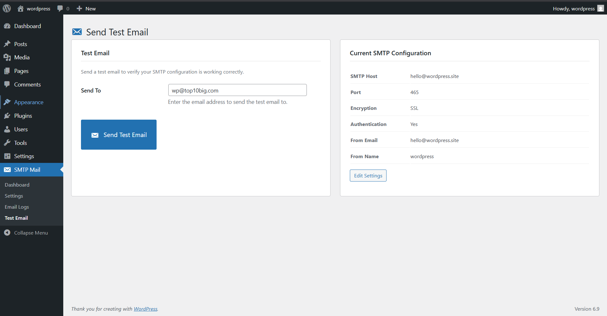

# Simple SMTP Mail

A powerful, open-source WordPress SMTP plugin with comprehensive email logging, queue management, backup SMTP failover, and a modern admin dashboard.

## ✨ Features

### 📧 SMTP Configuration
- **15+ Pre-configured Providers** - Gmail, Outlook, SendGrid, Mailgun, Amazon SES, Brevo, Postmark, SparkPost, Zoho, and more
- **Custom SMTP Support** - Use any SMTP server
- **Encryption Options** - TLS, SSL, or None
- **Authentication** - Username/password with encrypted storage

### 📊 Email Logging
- **Complete Email History** - Track all sent, failed, and queued emails
- **Searchable Logs** - Find emails by recipient, subject, or status
- **Export Options** - Download logs as CSV or JSON
- **Retention Policy** - Automatic cleanup after configurable days

### 🔄 Email Queue
- **Background Processing** - Queue emails for scheduled sending
- **Rate Limiting** - Prevent SMTP throttling
- **Retry Mechanism** - Automatic retry for failed emails
- **Priority Support** - Process important emails first

### 🔒 Backup SMTP (Failover)
- **Automatic Fallback** - Switch to backup SMTP when primary fails
- **Zero Downtime** - Ensure email delivery reliability

### 🛡️ Security
- **Password Encryption** - AES-256-CBC encryption at rest
- **Rate Limiting** - Prevent test email abuse
- **Auth Failure Logging** - Track failed authentication attempts
- **Nonce Verification** - CSRF protection on all forms
- **Capability Checks** - Admin-only access

### 🔐 Privacy & GDPR
- **WordPress Privacy Tools** - Integrated data exporter & eraser
- **Data Minimization** - Option to exclude email content from logs
- **Anonymization** - Option to anonymize instead of delete
- **Privacy Policy** - Auto-suggested privacy policy text
- **Automatic Retention** - Scheduled cleanup of old data

### 🎨 Modern Dashboard
- **Email Statistics** - Today, week, month, and all-time stats
- **Quick Actions** - Send test email, view logs, manage queue
- **System Status** - SMTP connection health check
- **Responsive Design** - Works on all screen sizes

## 📥 Installation

### From GitHub
1. Download the latest release
2. Upload to `/wp-content/plugins/simple-smtp-mail/`
3. Activate the plugin through the 'Plugins' menu
4. Go to **SMTP Mail → Settings** to configure

### From WordPress Admin
1. Go to **Plugins → Add New**
2. Click **Upload Plugin**
3. Upload the ZIP file
4. Activate and configure

## ⚙️ Configuration

### Quick Setup
1. Navigate to **SMTP Mail → Settings**
2. Select your SMTP provider from the dropdown
3. Enter your credentials
4. Click **Test Connection**
5. Save settings

### Supported Providers
| Provider | Port | Encryption |
|----------|------|------------|
| Gmail | 587 | TLS |
| Outlook/Hotmail | 587 | TLS |
| Office 365 | 587 | TLS |
| SendGrid | 587 | TLS |
| Mailgun | 587 | TLS |
| Amazon SES | 587 | TLS |
| Brevo (Sendinblue) | 587 | TLS |
| Postmark | 587 | TLS |
| SparkPost | 587 | TLS |
| Zoho Mail | 587 | TLS |

## 📸 Screenshots

### Dashboard

### Settings

### Email Logs

### Send Test Email

## 🔧 Requirements

- WordPress 6.0 or higher
- PHP 7.4 or higher
- OpenSSL extension (for password encryption)

## 🤝 Contributing

Contributions are welcome! Please feel free to submit a Pull Request.

1. Fork the repository
2. Create your feature branch (`git checkout -b feature/AmazingFeature`)
3. Commit your changes (`git commit -m 'Add some AmazingFeature'`)
4. Push to the branch (`git push origin feature/AmazingFeature`)
5. Open a Pull Request

## 📄 License

This project is licensed under the GPL v2 or later - see the [LICENSE](LICENSE) file for details.

## 👨‍💻 Author

**Boopathi R.**
- LinkedIn: [@boopathirb](https://linkedin.com/in/boopathirb)
- GitHub: [@boopathirbk](https://github.com/boopathirbk)

## ☕ Support This Project

If you find this plugin useful, consider buying me a coffee!

Your support helps keep this project alive and free for everyone! 🙏

## 📝 Changelog

### 1.0.0 (2025-12-06)
- Initial release
- SMTP configuration with 15+ provider presets
- Email logging with search and export
- Email queue with background processing
- Backup SMTP failover
- GDPR-compliant privacy features
- Modern admin dashboard
- Rate limiting and security logging

---

Made with ❤️ for the WordPress community
